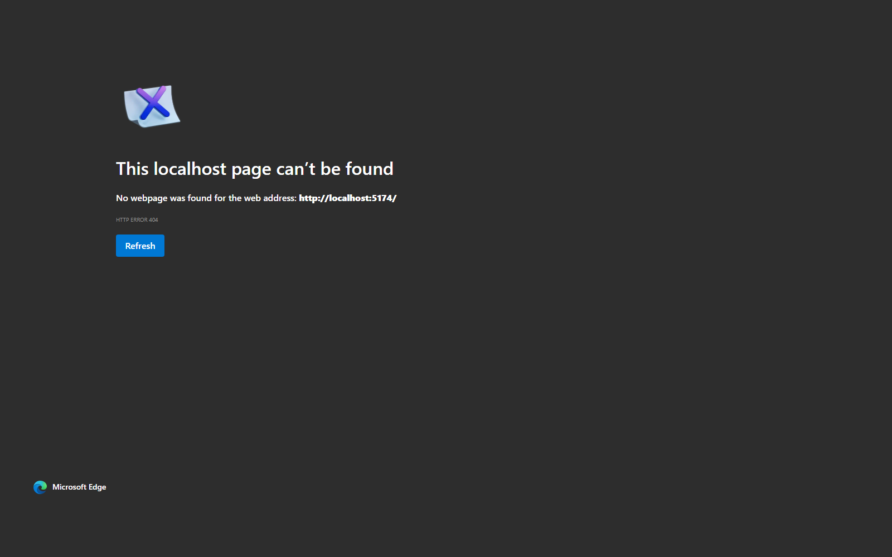

# Replit Clone (MVP)

A Replit-style web IDE built with React + TypeScript + Vite.

## Preview

Live app: https://replit-clone-delta.vercel.app/

[](https://replit-clone-delta.vercel.app/)

This project includes:
- File explorer sidebar
- Monaco code editor
- Preview iframe panel
- Console/log panel
- Run button to rebuild and refresh preview

## Tech Stack

- React 18
- TypeScript
- Vite
- Monaco Editor (`@monaco-editor/react`)

## Getting Started

### 1. Install dependencies

```bash
npm install
```

### 2. Start the app

```bash
npm run dev
```

Open the URL shown in the terminal (usually `http://localhost:5173`).

### 3. Production build

```bash
npm run build
```

## Project Structure

```text
.
├─ src/
│  ├─ App.tsx
│  ├─ main.tsx
│  ├─ styles.css
│  └─ vite-env.d.ts
├─ index.html
├─ package.json
├─ tsconfig.json
└─ vite.config.ts
```

## Notes

- This is an MVP frontend clone, not a full Replit backend.
- It does not yet include containerized execution, auth, database persistence, or multiplayer collaboration.

## Roadmap Ideas

- Add nested folder/file tree operations
- Add tabbed editor experience
- Add console bridge from iframe to app console
- Add backend execution sandbox
- Add auth and persistent projects
